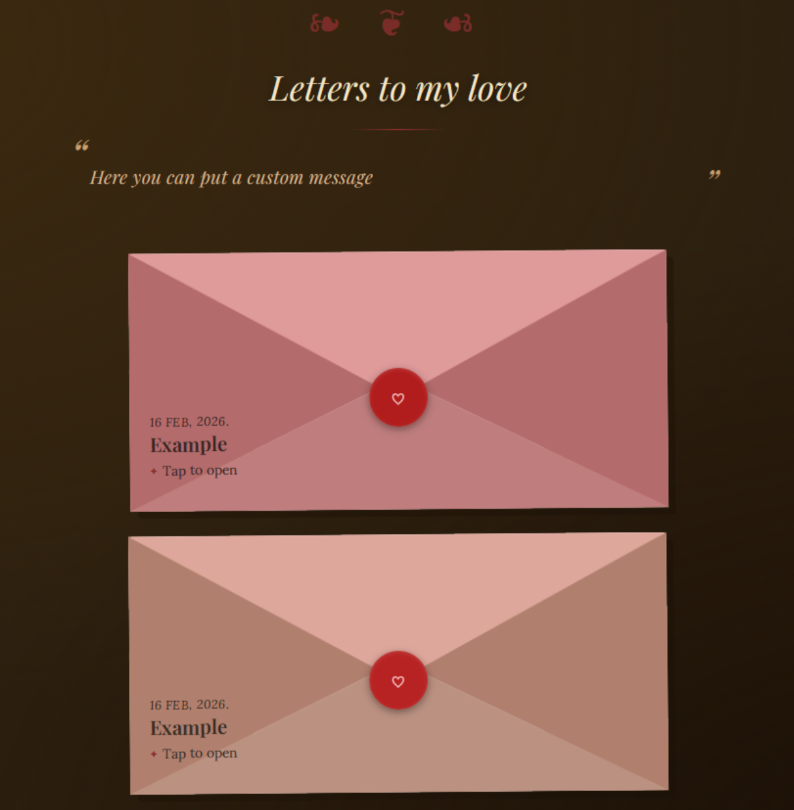
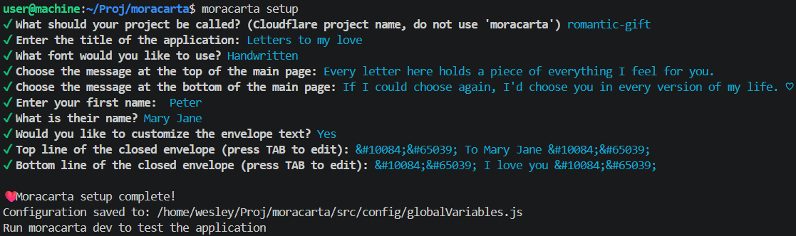
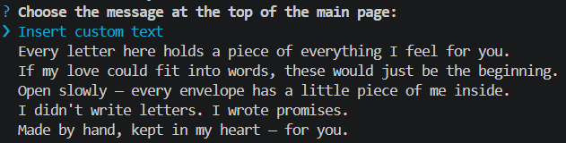
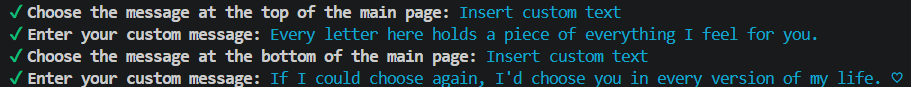

# Moracarta

**Create your own personalized love-letter website and deploy it completely for free. Available as an npm package**

[](https://www.npmjs.com/package/moracarta)
[](https://www.npmjs.com/package/moracarta)

🌐 **[Live Demo - Latest Stable Branch](https://moracarta.pages.dev/)** | 🛠️ **[Live Demo - Development Branch](https://development.moracarta.pages.dev/)**

## Features

💌 Multiple letters  
📝 Google Docs as your writing interface  
🎨 Customizable texts  
🌐 Free web deployment  
🔒 No database required  

## **You can have your own working URL in less than 5 minutes**

**And it's as simple as:**

```bash
npm i moracarta
npx moracarta setup
npx moracarta build
npx moracarta deploy
```
### What each command does

- `npm i moracarta` installs Moracarta as a dependency in your project.
- `npx moracarta setup` sets up Moracarta and lets you configure the website.
- `npx moracarta build` builds your website using your configured letters and settings.
- `npx moracarta deploy` deploys the finished website for free.

### App Demo
<p align="center">
    
    
</p>

### Setup Demo


<br>

## That's it.

All that's left is to write your letters in Google Docs and, if you want, customize the two texts displayed on the main page.

## Requirements

- Node.js 22+
- A Google account

### Adding letters

```bash
moracarta add
```

* Paste the link to your public Google Doc.
* **IMPORTANT:** Use spaces for indentation instead of `TAB`.
* Use a different Google Docs **tab** for each letter to keep your Google Doc organized.  

<p align="center">
    
</p>
<br>

### Removing letters

```bash
moracarta remove
```

Select the letter you wish to remove.

### Customizing the website

During `moracarta setup`, you can choose from preset messages or enter your own custom text for the main page.

<p align="center">
    <br>
    
</p>

## License

Moracarta is open-source software licensed under the **MIT License**.

See the [LICENSE](LICENSE) file for the full license text.
